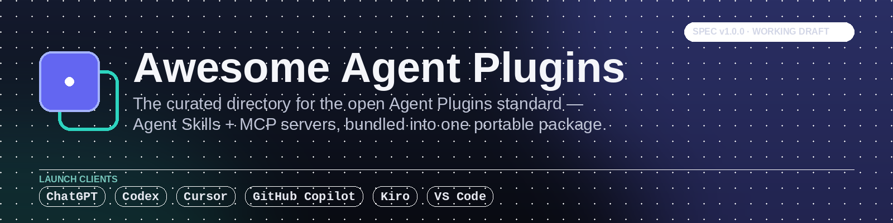

<p align="center">
  
</p>

<p align="center">
  <a href="https://awesome.re"></a>
  
  
  
  
  
</p>

# Awesome Agent Plugins

**A curated, verified directory of 33 Agent Plugins.** [Agent Plugins](https://agentplugins.codes/) is the
open, vendor-neutral standard published on 2026-08-06 by Amazon, Anysphere/Cursor, GitHub, Microsoft, OpenAI
and Vercel, with Google as a core maintainer. It bundles **Agent Skills and MCP servers** into one portable,
drop-in folder that every compliant client can read.

Every entry below is checked against a live `plugin.json` carrying the canonical 1.0.0 `$schema`. No link
dumps, no dead repos, and no per-client manifests dressed up as open-standard plugins. This is an unofficial,
community-maintained list and is not affiliated with the Agent Plugins Working Group.

---

## Contents

- [What is an Agent Plugin?](#what-is-an-agent-plugin)
- [Quickstart: build your first Agent Plugin in 5 minutes](#quickstart-build-your-first-agent-plugin-in-5-minutes)
- [Client support matrix: which clients support Agent Plugins](#client-support-matrix-which-clients-support-agent-plugins)
- [⭐ Plugin of the Week](#-plugin-of-the-week)
- [The catalog: verified Agent Plugins](#the-catalog-verified-agent-plugins)
- [Agent Skills and MCP servers ready to be packaged as plugins](#agent-skills-and-mcp-servers-ready-to-be-packaged-as-plugins)
- [Tools: validate and scaffold a plugin](#tools-validate-and-scaffold-a-plugin)
- [Agent Plugins spec and resources](#agent-plugins-spec-and-resources)
- [🛡️ Security notice](#️-security-notice)
- [🤝 Contributing](#-contributing)
- [Related lists](#related-lists)

---

## What is an Agent Plugin?

An **Agent Plugin** is a directory with a `plugin.json` manifest at its root. It's the packaging format the
Agent Plugins Working Group (Amazon, Cursor, GitHub, Microsoft, OpenAI, Vercel) published on 2026-08-06 to give
**Agent Skills** and **MCP server configs** one portable, install-once shape that every compliant client can
read — instead of writing a separate integration for each client.

```
plugin-name/
├── plugin.json               # REQUIRED — $schema + name. Optional: version, description,
│                              # license, keywords[], author, homepage, repository, extensions
├── skills/
│   └── <skill-name>/
│       ├── SKILL.md           # one skill per immediate child dir — NOT searched recursively
│       ├── scripts/
│       └── references/
├── mcp.json                   # OPTIONAL — mcpServers{}: stdio | streamable-http | sse
└── com.vendor.client/         # OPTIONAL — namespaced client-specific extensions
```

Minimal valid `plugin.json`:

```json
{
  "$schema": "https://agent-plugins.org/schemas/1.0.0/plugin.schema.json",
  "name": "my-first-plugin"
}
```

**What the spec deliberately does *not* cover** — and this is the part worth being precise about, because it's
what most secondary write-ups blur: Agent Plugins is a **packaging format only**. It defines the manifest, the
fixed component locations, and two runtime variables (`${PLUGIN_ROOT}`, the package root; `${PLUGIN_DATA}`, a
persistent writable directory) that clients expand in `args`, `env` values and `cwd` — never in `command`, URLs,
or header keys. It has **no opinion on distribution, marketplaces, permissions, or how a client installs a
plugin** — each client (VS Code, Cursor, ChatGPT/Codex, GitHub Copilot, Kiro, and Google's tooling as core
maintainer) owns that layer itself. It also enforces real security boundaries: every path a plugin ships must
resolve inside the plugin root (symlink escapes are rejected), `command` in `mcp.json` is a single executable
token that is never shell-interpolated, and there's no portable field for embedding credentials.

## Quickstart: build your first Agent Plugin in 5 minutes

```bash
mkdir -p hello-plugin/skills/say-hello
cd hello-plugin

cat > plugin.json <<'EOF'
{
  "$schema": "https://agent-plugins.org/schemas/1.0.0/plugin.schema.json",
  "name": "hello-plugin",
  "version": "0.1.0",
  "description": "A minimal Agent Plugin — one skill, no MCP server.",
  "license": "MIT"
}
EOF

cat > skills/say-hello/SKILL.md <<'EOF'
---
name: say-hello
description: Greet the user by name and explain what this plugin does.
---

# Say Hello
1. Ask for the user's name if not already known.
2. Reply with a friendly greeting.
3. Mention that this plugin came from a `SKILL.md` file with zero extra config.
EOF

# Validate against the canonical schema before you ship it (see Tools below)
npx -y ajv-cli@5 validate --spec=draft2020 \
  -s https://agent-plugins.org/schemas/1.0.0/plugin.schema.json \
  -d plugin.json
```

Point a compliant client at the `hello-plugin/` folder (in VS Code: **Chat: Install Plugin From Source**) and
you have a working plugin — no `mcp.json` required, since it's optional. Add one when you actually need an MCP
server; see [`upstash/context7`](#the-catalog-verified-agent-plugins) below for a real `mcp.json` in production.

## Client support matrix: which clients support Agent Plugins

Verified against each vendor's own docs/announcement as of 2026-08-12. `✅` confirmed · `❓` not yet confirmed in
public docs — please open a PR with a source if you can confirm it.

| Client | Skills | MCP servers | Client extensions (`com.vendor.*`) | Install path |
|---|---|---|---|---|
| **VS Code** | ✅ | ✅ | ❌ ignored today ([docs](https://code.visualstudio.com/docs/agent-customization/agent-plugins)) | `@agentPlugins` in Extensions view · **Chat: Install Plugin From Source** · auto-appears after install via Copilot CLI. Requires `chat.plugins.enabled`. |
| **GitHub Copilot** (VS Code, CLI, app) | ✅ | ✅ | ❓ | Shared install path with VS Code above; also via Copilot CLI. |
| **Codex / Codex CLI** | ✅ (discovers + reads plugin skills) | ✅ (opt-in MCP 2026-07-28 protocol, paginated discovery) | ❓ | Codex CLI workspace plugin install; marketplace details unconfirmed. |
| **ChatGPT** | ✅ (plugins can bundle skills) | ❓ | ❓ | Install UX not independently confirmed at time of writing — see [Codex Knowledge Base writeup](https://codex.danielvaughan.com/2026/08/08/agent-plugins-1-0-open-standard-codex-cli-portable-skills-mcp-packaging/). |
| **Cursor** | ✅ | ✅ | ❓ | Listed as a launch client by Vercel's announcement; specific install flow not independently confirmed — PRs welcome. |
| **Kiro** | ✅ | ✅ | ❓ | Via "Kiro Powers" installable packages ([AWS Open Source Blog](https://aws.amazon.com/blogs/opensource/aws-supports-agent-plugins-an-open-standard-for-portable-agent-extensions/)). |

Google joined as a **core maintainer** on launch day (not a launch client) and is integrating support starting
with Agents CLI and the Data Agent Kit.

If you run one of the `❓` cells day to day, open a PR — a one-line source link is all we need to flip it to ✅.

## ⭐ Plugin of the Week

**[sentry](https://github.com/getsentry/sentry-for-ai/tree/main/src/plugins/agent-plugin)** by
[Sentry](https://sentry.io) — the plugin that made this week interesting: Sentry is the first major
observability vendor to publish a manifest carrying the canonical
`https://agent-plugins.org/schemas/1.0.0/plugin.schema.json` `$schema`, rather than yet another stack of
per-client folders. Practically, it teaches your agent to wire up Sentry in a new project, then pull a real
production stack trace and debug from it instead of from your description of the bug — the gap between
"tests pass locally" and "it's broken for 4% of users" is exactly where an agent is otherwise blind.
Install: point a compliant client at `src/plugins/agent-plugin` in the repo above.

*Rotates weekly. Nominate an entry by opening an issue with the `pick-of-the-week` label.*

## The catalog: verified Agent Plugins

> **Adoption reality check — verified 2026-08-17.** We scanned the manifests of 34 major vendor skill/MCP
> repositories. Most ship **per-client** manifests — `.claude-plugin/`, `.cursor-plugin/`, `.codex-plugin/`,
> `.grok-plugin/` — rather than one portable open-spec `plugin.json`. Vercel, Cloudflare, Stripe, Railway,
> MongoDB, Wix, Axiom, Chrome DevTools and Superpowers all currently do this. Only a handful publish a manifest
> carrying the canonical `$schema` of `https://agent-plugins.org/schemas/1.0.0/plugin.schema.json` — Sentry,
> Neon, Upstash's context7, Qdrant and the spec's own example among them.
>
> Every entry in this catalog is checked for that `$schema`, which is why this list is shorter than a link dump
> would be. You can verify any entry yourself by opening its `plugin.json`. Know one we've missed? Please
> [open a PR](#-contributing).

Format: `- [name](repo-url) by [author](author-url) — one-line description. **[tag]**`
Tags: **production** (used in the wild) · **beta** · **experimental** · **reference** (spec/example, not meant to run standalone)

### Official & Reference

- [agent-plugins-spec](https://github.com/agentplugins/agent-plugins-spec) by [Agent Plugins Working Group](https://agentplugins.codes/) — the canonical v1.0.0 spec text, JSON schemas, and governance docs. **[reference]**
- [agent-plugins-example](https://github.com/agentplugins/agent-plugins-example) by [Agent Plugins Working Group](https://agentplugins.codes/) — the canonical v1 example plugin and migration guide; the fastest way to see a compliant layout end to end. **[reference]**
- [awesome-copilot](https://github.com/github/awesome-copilot) by [GitHub](https://github.com/github) — GitHub's own collection of 94 compliant plugins spanning languages, cloud platforms and workflows; still the single largest source of real plugins, though no longer the majority of this catalog. **[production]**

### Dev & Coding

- [csharp-dotnet-development](https://github.com/github/awesome-copilot/tree/main/plugins/csharp-dotnet-development) by [Awesome Copilot Community](https://github.com/github/awesome-copilot) — C#/.NET prompts, instructions and chat modes for testing, docs and best practices. **[production]**
- [daisyui](https://github.com/saadeghi/daisyui) by [saadeghi](https://github.com/saadeghi) — the official daisyUI component-library plugin for building Tailwind CSS interfaces. **[production]**
- [swiftui-expert](https://github.com/AvdLee/SwiftUI-Agent-Skill) by [Antoine van der Lee](https://www.avanderlee.com) — expert SwiftUI guidance for state management, view composition, performance and iOS 26+ Liquid Glass adoption. **[production]**
- [testing-automation](https://github.com/github/awesome-copilot/tree/main/plugins/testing-automation) by [Awesome Copilot Community](https://github.com/github/awesome-copilot) — unit, integration and end-to-end testing plus TDD workflows. **[production]**

### Data & APIs

- [dak](https://github.com/gemini-cli-extensions/data-agent-kit-starter-pack) by [Google](https://github.com/gemini-cli-extensions) — data-engineering skills for Google Cloud: pipeline architecture, dbt transforms, Spark/BigQuery SQL notebooks. **[production]**
- [database-data-management](https://github.com/github/awesome-copilot/tree/main/plugins/database-data-management) by [Awesome Copilot Community](https://github.com/github/awesome-copilot) — PostgreSQL/SQL Server administration, optimization and data-management guidance. **[production]**
- [hindsight](https://github.com/vectorize-io/hindsight/tree/main/hindsight-integrations/agent-plugin) by [Vectorize](https://hindsight.vectorize.io) — long-term agent memory (retain/recall/reflect) exposed as portable MCP tools. **[production]**
- [neon-postgres](https://github.com/neondatabase/agent-skills) by [Neon](https://neon.com) — manage a Neon serverless Postgres backend: branching, object storage, functions, AI Gateway. **[production]**
- [qdrant](https://github.com/qdrant/mcp-server-qdrant/tree/master/kiro-power) by [Qdrant](https://qdrant.tech) — stores and retrieves semantic memories via vector search. **[production]**
- [zillapi](https://github.com/ZeroPointRepo/zillow-plugin) by [Zillapi](https://zillapi.com) — live Zillow property data: Zestimates, full records, comps and listing search on 160M+ U.S. homes. **[production]**

### Search & Research

- [context7](https://github.com/upstash/context7/tree/master/plugins/agent-plugins/context7) by [Upstash](https://github.com/upstash) — version-specific library documentation pulled straight into LLM context. **[production]**
- [exa](https://github.com/exa-labs/exa-mcp-server) by [Exa](https://docs.exa.ai/reference/exa-mcp) — real-time web search, code search and web crawling with configurable tool selection. **[production]**
- [scientific-agent-skills](https://github.com/K-Dense-AI/scientific-agent-skills) by [K-Dense Inc.](https://k-dense.ai) — 158 ready-to-use scientific and research skills across biology, chemistry, medicine and drug discovery. **[production]**
- [stayingapi](https://github.com/stayingapi/hotel-vacation-rental-mcp) by [StayingAPI](https://stayingapi.com) — search, availability, pricing and cross-OTA price comparison across Airbnb, Booking.com, Vrbo and Google Hotels. **[production]**

### Browser & Automation

- [chromium-control-canvas](https://github.com/github/awesome-copilot/tree/main/plugins/chromium-control-canvas) by [Andrea Griffiths](https://github.com/AndreaGriffiths11) — opens a real Chromium window you can navigate and interact with from a canvas control panel and agent actions. **[production]**

### Productivity

- [backlog-swipe-triage](https://github.com/github/awesome-copilot/tree/main/plugins/backlog-swipe-triage) by [James Montemagno](https://github.com/jamesmontemagno) — swipe through backlog issues to assign, defer, close or ignore. **[production]**
- [project-planning](https://github.com/github/awesome-copilot/tree/main/plugins/project-planning) by [Awesome Copilot Community](https://github.com/github/awesome-copilot) — feature breakdown, epic management and implementation planning for dev teams. **[production]**
- [release-notes-showcase](https://github.com/github/awesome-copilot/tree/main/plugins/release-notes-showcase) by [Kayla Cinnamon](https://github.com/cinnamon-msft) — compose launch-ready release notes with contributor callouts. **[production]**
- [where-was-i](https://github.com/github/awesome-copilot/tree/main/plugins/where-was-i) by [Aaron Powell](https://github.com/aaronpowell) — reconstructs your dev context (branch, commits, PR clues) to resume work fast. **[production]**

### DevOps

- [agentic-bundle-devops-cloud](https://github.com/sickn33/agentic-awesome-skills/tree/main/plugins/agentic-bundle-devops-cloud) by [sickn33 and contributors](https://github.com/sickn33/agentic-awesome-skills) — portable DevOps & Cloud skills bundle: AWS serverless, CI/CD, Docker, Kubernetes, Terraform. **[production]**
- [aws-cloud-development](https://github.com/github/awesome-copilot/tree/main/plugins/aws-cloud-development) by [Awesome Copilot Community](https://github.com/github/awesome-copilot) — AWS infrastructure-as-code, serverless, architecture patterns and cost optimization. **[production]**
- [aws-core](https://github.com/aws/agent-toolkit-for-aws/tree/main/plugins/aws-core) by [Amazon Web Services](https://aws.amazon.com/products/developer-tools/agent-toolkit-for-aws/) — official AWS skills for IaC (CDK/CloudFormation), core services, databases, observability and cost optimization. **[production]**
- [devops-oncall](https://github.com/github/awesome-copilot/tree/main/plugins/devops-oncall) by [Awesome Copilot Community](https://github.com/github/awesome-copilot) — incident triage prompts and a chat mode for DevOps/Azure on-call response. **[production]**
- [sentry](https://github.com/getsentry/sentry-for-ai/tree/main/src/plugins/agent-plugin) by [Sentry](https://sentry.io) — set up Sentry, debug production issues from real stack traces, and configure alerting and release health from the agent. **[production]**

### Content & Media

- [skill-image-gen](https://github.com/github/awesome-copilot/tree/main/plugins/skill-image-gen) by [adamd9](https://github.com/adamd9) — AI image generation (OpenAI gpt-image-2, Google Gemini) from inside your coding workflow, BYO API key. **[production]**
- [transcriptapi](https://github.com/ZeroPointRepo/youtube-mcp) by [TranscriptAPI](https://transcriptapi.com) — YouTube transcripts, video and channel search, playlist extraction, no API key to manage. **[production]**

### Security

- [security-best-practices](https://github.com/github/awesome-copilot/tree/main/plugins/security-best-practices) by [Awesome Copilot Community](https://github.com/github/awesome-copilot) — security frameworks, accessibility guidelines, and code-quality best practices. **[production]**
- [squirrelscan](https://github.com/squirrelscan/squirrelscan) by [squirrelscan](https://squirrelscan.com) — website QA for coding agents: 260+ rules across SEO, performance, security and accessibility, audit from the CLI or over MCP. **[production]**

### Finance

- [dodopayments](https://github.com/dodopayments/dodo-agent-plugin) by [Dodo Payments](https://docs.dodopayments.com) — official Dodo Payments plugin: 17 integration skills (checkout, subscriptions, billing, refunds) plus API and docs MCP servers. **[production]**
- [open-market-data](https://github.com/anotb/open-market-data) by [anotb](https://github.com/anotb) — read-only stock, SEC, crypto and macroeconomic data with normalized provenance. **[production]**

## Agent Skills and MCP servers ready to be packaged as plugins

The Agent Plugins ecosystem is eleven days old at the time of writing, so most of the world's best Agent Skills
and MCP servers **aren't plugins yet** — they just need a `plugin.json` dropped on top. This section is not
the catalog above: nothing here has shipped a compliant manifest. It's a punch list of high-quality, real,
maintained skills/MCP servers that would make excellent plugins, listed here so day-one readers still get
something useful instead of an empty repo. Once one of these ships a `plugin.json`, it graduates to the
catalog above (via PR — see [Contributing](#-contributing)).

- [ahujasid/blender-mcp](https://github.com/ahujasid/blender-mcp) by [ahujasid](https://github.com/ahujasid) — control Blender 3D from any LLM. **[mcp]**
- [anthropics/skills](https://github.com/anthropics/skills) by [Anthropic](https://github.com/anthropics) — the official reference repo for the Agent Skills format that every plugin's `skills/` folder builds on. **[skills]**
- [browserbase/skills](https://github.com/browserbase/skills) by [Browserbase](https://github.com/browserbase) — official agent skills for driving a real browser via Stagehand; a second Browser & Automation plugin candidate. **[mcp]**
- [cloudflare/mcp-server-cloudflare](https://github.com/cloudflare/mcp-server-cloudflare) by [Cloudflare](https://github.com/cloudflare) — manage Cloudflare resources (Workers, KV, R2, DNS) from an agent. **[mcp]**
- [grafana/mcp-grafana](https://github.com/grafana/mcp-grafana) by [Grafana Labs](https://github.com/grafana) — query dashboards, alerts and datasources via MCP. **[mcp]**
- [microsoft/playwright-mcp](https://github.com/microsoft/playwright-mcp) by [Microsoft](https://github.com/microsoft) — Playwright-driven browser control MCP server. **[mcp]**
- [modelcontextprotocol/servers](https://github.com/modelcontextprotocol/servers) by [Model Context Protocol](https://github.com/modelcontextprotocol) — the official reference MCP server collection; the other half of most future plugins. **[mcp]**

*Sentry graduated out of this section on 2026-08-17 — `getsentry/sentry-for-ai` now ships a compliant
`plugin.json` and is listed in the catalog above. TranscriptAPI, Zillapi and StayingAPI graduated earlier.*

## Tools: validate and scaffold a plugin

- [`ajv-cli`](https://github.com/ajv-validator/ajv-cli) against the canonical schemas — the validation one-liner multiple plugin authors in the catalog above ship in their own CI:
  ```bash
  npx -y ajv-cli@5 validate --spec=draft2020 \
    -s https://agent-plugins.org/schemas/1.0.0/plugin.schema.json -d plugin.json
  npx -y ajv-cli@5 validate --spec=draft2020 \
    -s https://agent-plugins.org/schemas/1.0.0/mcp.schema.json -d mcp.json
  ```
- [`eng/create-plugin.mjs`](https://github.com/github/awesome-copilot/blob/main/eng/create-plugin.mjs) by GitHub — the scaffolder GitHub's own contributors use to generate new plugins inside `awesome-copilot`; a good reference for writing your own.

*This section is intentionally short. If you maintain a standalone Agent Plugins validator, linter, or
scaffolder, open a PR — it's an empty niche and first-mover here is real.*

## Agent Plugins spec and resources

- [Agent Plugins — spec site](https://agentplugins.codes/)
- [agentplugins/agent-plugins-spec](https://github.com/agentplugins/agent-plugins-spec) — spec text, schemas, governance
- [Plugin manifest schema](https://agent-plugins.org/schemas/1.0.0/plugin.schema.json) · [MCP config schema](https://agent-plugins.org/schemas/1.0.0/mcp.schema.json)
- [Vercel — Introducing Agent Plugins 1.0.0](https://vercel.com/changelog/introducing-agent-plugins-1-0-0)
- [AWS Open Source Blog — AWS supports Agent Plugins](https://aws.amazon.com/blogs/opensource/aws-supports-agent-plugins-an-open-standard-for-portable-agent-extensions/)
- [VS Code docs — Agent plugins in VS Code](https://code.visualstudio.com/docs/agent-customization/agent-plugins)
- [Agent Plugins 1.0 and the Codex CLI plugin strategy](https://codex.danielvaughan.com/2026/08/08/agent-plugins-1-0-open-standard-codex-cli-portable-skills-mcp-packaging/)
- [ZeroPointRepo/awesome-grok-bot](https://github.com/ZeroPointRepo/awesome-grok-bot) — our sister list on Grok Bot (xAI + Cursor). Cursor is a launch client of this spec, but as of this writing Grok Bot's real plugin marketplace still runs on Cursor's own pre-existing `.cursor-plugin`/`.grok-plugin` manifest format, not this one — worth watching, not worth assuming.

## 🛡️ Security notice

This is a **curated list, not an audit**. Entries here are verified to have a real, schema-valid `plugin.json`
and a resolving repository at the time they were added — that is a packaging check, not a security review. The
spec itself enforces path containment and forbids shell-interpolated commands and embedded credentials, but a
plugin can still request an MCP server that talks to a service you don't trust, or a skill that gives bad
instructions. **Read a plugin before you install it**, the same as you would a package or a browser extension.
Report a plugin that misbehaves via [an issue](../../issues/new/choose) and we'll pull it pending review.

## 🤝 Contributing

PRs are very welcome — see [CONTRIBUTING.md](CONTRIBUTING.md) for the format and the four acceptance rules.
**Disclosure:** the maintainer of this list also builds some of the tools listed in it
([TranscriptAPI](https://transcriptapi.com), [StayingAPI](https://stayingapi.com), [Zillapi](https://zillapi.com)).
Our own entries follow the exact same format and bar as everyone else's, appear at most once per category, and
we never reject a competing entry to protect ours — see the disclosure section of CONTRIBUTING.md for the full
policy.

---

## Related lists

Three sister lists, same standard, same maintainer. Each one covers a different agent ecosystem.

- [awesome-hermes-skills](https://github.com/ZeroPointRepo/awesome-hermes-skills): skills, plugins, agent profiles and memory providers for Hermes Agent.
- [awesome-grok-bot](https://github.com/ZeroPointRepo/awesome-grok-bot): skills, plugins and MCP wiring for xAI and Cursor's Grok Bot.
- [awesome-dsh-usecases](https://github.com/ZeroPointRepo/awesome-dsh-usecases): what people actually build with DeepSeek Harness, each entry with a working install command.

---

<p align="center">
Maintained by <a href="https://github.com/ZeroPointRepo">ZeroPointRepo</a> · list content licensed
<a href="https://creativecommons.org/licenses/by/4.0/">CC BY 4.0</a> · Built with <a href="https://crhq.ai">crhq.ai</a>
<br />
<sub>This is an unofficial, community-maintained list. It is not affiliated with or endorsed by the Agent
Plugins Working Group or any of its member organisations.</sub>
</p>
